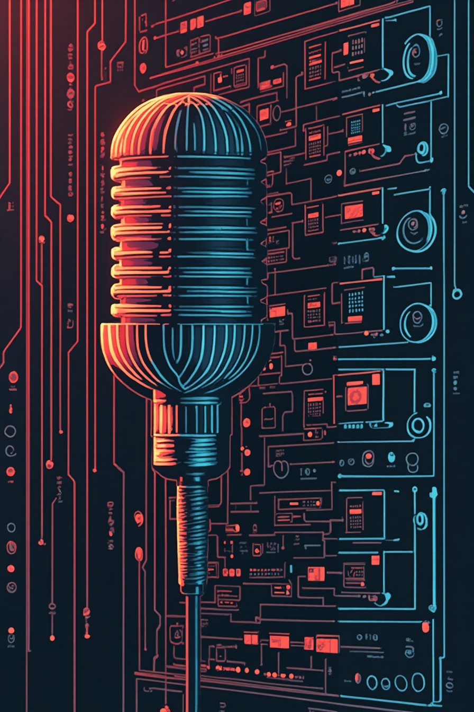

    preview do podcast

    <audio src="output/podcast_editado.MP3" controls title="Podcast editado"></audio>

# PodCast: Do Mainframe ao TikTok: O Papel do CICS hoje: Como a tecnologia tradicional ainda sustenta a era digital moderna

# Projeto PODCAST Gerado por I.A.s

 > ℹ️ **NOTE:** Este é um podcast criado durante o Bootcamp CAIXA - IA Generativa com Microsoft Copilot realizado na plataforma [DIO](https://dio.me)

Projeto com o objetivo de gerar um podcast com as facilidades das ferramentas de IA. todos os prompts seguem abaixo.

<a href="https://github.com/lcarol19/prompts-recipe-to-create-a-ebook/blob/main/Explorando-a-linguagem-COBOL.pdf" title="View PDF now"> 📕Clique aqui para ler</a>

## 💻 Tecnologias utilizadas no projeto

- [ChatGPT](https://chat.openai.com/) 
- [Leonardo.ai](https://app.leonardo.ai//) 
- [Elevenlabs](https://elevenlabs.io/)

## 🧠 Prompts

ChatGPT：

|  Ação    |prompt                                                                                 
| :------: | -------------------------------------------------------------------------------------------------------------------------------------------------------------------------------------------------------------------------------------------------------------------------------------------------------------------------------------------------------------------------------------------------------------------------------------------------------------------------------------------------------------------------------------------------------------------------------------------------------------------------------------------------------------------------------------------------------------------------------------------------------------------------- |
| conteúdo | Atue como um [roteirista] de podcast de tecnologia da geração Y e explique o que é CICS em Mainframe e sua utilidade para o público alvo tech da geração Z fazendo uma comparação com novas tecnologias O formato do roteiro deve conter [Introdução] [Utilização] [Finalização] {Regras} No bloco [Introdução] o [roteirista] com descontração deve explicar o que é CICS em Mainframe e comparar com uma nova tecnologia No bloco [Utilização] o [roteirista] deve explicar para que serve e como funciona o CICS No bloco [Finalização] o [roteirista] fará a conclusão da fala sobre CICS O podcast deve ser apresentado por uma única pessoa {Regras Negativas} O podcast não pode ultrapassar cinco minutos Não use muito termos técnicos Não fale como um tiozão

ChatGPT：

|  Ação    |prompt                                                                            |     
| :------: | ---------------------------------------------------------------------------------|
|  título  | Me dê 5 sugestões de título e subtítulo do podcast baseado no texto gerado acima |

Leonardo.ai：

|  Ação  | prompt                                                                                       |
| :----: | -------------------------------------------------------------------------------------------- |
| imagem | Crie uma imagem para um podcast que explica mainframe para o público alvo tech da geração Z. |

## ✨ Features

- Conteúdo gerado via ChatGPT
- Imagem gerada via Leonardo.ai
- Áudio gerado no Elevenlabs

